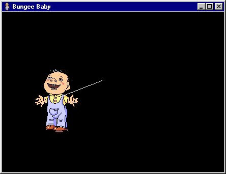



## Bungee Baby

### Description

The original idea, graphics and sound came from an email I got with some JavaScript code to perform the same, but it was incredibly slow, so someone asked me to create a stand-alone program out of it, and this was the result.  

It demonstrates the BitBlt and LineTo API, and GetTickCount used in a loop. And furthermore, it's fun! :)  

Just hope this helps in some way, please leave comments and don't forget to vote!
 
### More Info
 

             |
---                |---
**Submitted On**   |2001-06-05 11:21:42
**By**             |[Mark van Renswoude](https://github.com/Planet-Source-Code/PSCIndex/blob/master/ByAuthor/mark-van-renswoude.md)
**Level**          |Intermediate
**User Rating**    |4.7 (28 globes from 6 users)
**Compatibility**  |VB 5\.0, VB 6\.0
**Category**       |[Jokes/ Humor](https://github.com/Planet-Source-Code/PSCIndex/blob/master/ByCategory/jokes-humor__1-40.md)
**World**          |[Visual Basic](https://github.com/Planet-Source-Code/PSCIndex/blob/master/ByWorld/visual-basic.md)
**Archive File**   |[Bungee Bab20615652001\.zip](https://github.com/Planet-Source-Code/mark-van-renswoude-bungee-baby__1-23789/archive/master.zip)

